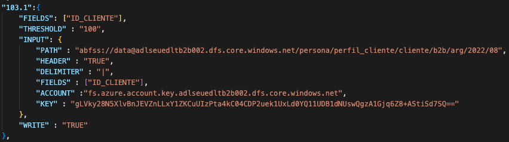

Para el json es necesario seguir la siguiente estructura

## Input
La sección input debe contener los siguientes atributos

|Atributo|Definición|Tipo|
| ------------- | ------------- | ------------|
|COUNTRY_ID|Acrónimo de Pais de la entidad|Obligatorio|
|PROJECT|Nombre de proyecto|Obligatorio|
|ENTITY_ID|Nombre de la entidad|Obligatorio|
|DOMAIN|Dominio de la entidad|Obligatorio|
|SUB_DOMAIN|Subdominio de la entidad|Obligatorio|
|SEGMENT|Segmento de la entidad|Obligatorio|
|AREA|Area de la entidad|Obligatorio|
|PATH|Ruta en la que se ubica el fichero que será evaluado|Aplica para todos los origenes excepto bases de datos|
|TYPE|Tipo de origen de datos|Opcional (Se aceptan parquet,csv,mysql y postgre, si se deja vacío se toma como csv)|
|HEADER|Valor de Cabecera para CSV (TRUE o FALSE)|Opcional (solo aplica para ficheros csv)|
|ACCOUNT|Nombre de cuenta de acceso para almacenamiento de azure|Opcional (solo aplica csv y parquet)|
|DELIMITER|Caracter delimitador para CSV|Opcional (solo aplica para ficheros csv)|
|KEY|Llave de acceso para almacenamiento de azure|Opcional (solo aplica csv y parquet)|
|HOST|URL del Host por la base de datos|Opcional (solo aplica para bases de datos)|
|PORT|Puerto de conexión a la base de datos (Para MYSQL "3306")|Opcional (solo aplica para bases de datos)|
|DATABASE_NAME|Nombre de la base de datos|Opcional (solo aplica para bases de datos)|
|DATABASE_TABLE|Nombre de la tabla en la base de datos|Opcional (solo aplica para bases de datos)|
|DATABASE_USER|Nombre de usuario de acceso para la base de datos|Opcional (solo aplica para bases de datos)|
|DATABASE_PASSWORD|Contraseña de acceso para la base de datos|Opcional (solo aplica para bases de datos)|

#### Ejemplo 

## Error
La sección error contiene la información necesaria para la escritura de la data observada y debe contener los siguiente atributos

|Atributo|Definición|Tipo|
| ------------- | ------------- | ------------|
|PATH|Ruta para la escritura|Obligatorio|
|HEADER|Valor de Cabecera para CSV (TRUE o FALSE)|Obligatorio|
|DELIMITER|Caracter delimitador para CSV|Obligatorio|
|ACCOUNT|Nombre de cuenta de acceso para almacenamiento de azure|Obligatorio|
|KEY|Llave de acceso para almacenamiento de azure|Obligatorio|

#### Ejemplo 

## Rules
La sección de reglas contiene las reglas que serán ejecutadas y los parámetros de ejecución que estas necesitan. En esta sección los atributos son los códigos de las reglas. Si es necesario ejecutar una regla más de una vez se puede anteponer 

1. [Regla de Nulos - 101](#regla-de-nulos-101)
2. [Regla de Duplicados - 102](#regla-de-duplicados-102)
3. [Regla de Integridad Referencial - 103](#regla-de-integridad-referencial-103)
4. [Regla de Formato de Fecha - 104](#regla-de-formato-de-fecha-104)
5. [Regla de Rango - 105](#regla-de-rango-105)
6. [Regla de Catálogo - 106](#regla-de-catálogo-106)
7. [Regla de Caracteres Prohibidos - 107](#regla-de-caracteres-prohibidos-107)
8. [Regla de Tipo de Dato(CSV) - 108](#regla-de-tipo-de-datocsv-108)
9. [Regla de Composición - 109](#regla-de-composición-109)
10. [Regla de longitud - 110](#regla-de-longitud-110)
11. [Regla de Tipo de Dato(Parquet) - 111](#regla-de-tipo-de-datoparquet-111)
12. [Regla de Formato Numerico - 112](#regla-de-tipo-de-formato-numerico-112)
13. [Regla de  Identidad numérica  - 113](#regla-de-identidad-numerica-113)

#### Ejemplo de la estructura de las reglas completa

## Output
La sección output contiene la información necesaria para la escritura de los resultados de la validación y debe contener los siguientes atributos

|Atributo|Definición|Tipo|
| ------------- | ------------- | ------------|
|PATH|Ruta para la escritura|Obligatorio|
|HEADER|Valor de Cabecera para CSV (TRUE o FALSE)|Obligatorio|
|DELIMITER|Caracter delimitador para CSV|Obligatorio|
|ACCOUNT|Nombre de cuenta de acceso para almacenamiento de azure|Obligatorio|
|KEY|Llave de acceso para almacenamiento de azure|Obligatorio|

#### Ejemplo
 
[Volver](#rules)

### Regla de Nulos-101
Esta regla evalúa si los registros dentro de las columnas específicas son nulos
Debe contener los siguientes atributos

|Atributo|Definición|Tipo|
| ------------- | ------------- | ------------|
|FIELDS|Lista que contiene el nombre de los columnas que serán evaluadas|Obligatorio|
|THRESHOLD|Umbral de calidad de ejecución|Obligatorio|
|WRITE|Valor que determina si se escribirá o no la data observada (TRUE o FALSE)|Opcional (Se toma TRUE por defecto)|

#### Ejemplo 
 
[Volver](#rules)

### Regla de Duplicados-102
Esta regla evalúa si los registros dentor las columnas específicadas son únicas en la tabla

|Atributo|Definición|Tipo|
| ------------- | ------------- | ------------|
|FIELDS|Lista que contiene el nombre de los columnas que serán evaluadas|Obligatorio|
|THRESHOLD|Umbral de calidad de ejecución|Obligatorio|
|WRITE|Valor que determina si se escribirá o no la data observada (TRUE o FALSE)|Opcional (Se toma TRUE por defecto)|

#### Ejemplo 
 
[Volver](#rules)

### Regla de Integridad Referencial-103
Esta regla evalúa si los registros de la entidad evaluada existen en la entidad de referencia

|Atributo|Definición|Tipo|
| ------------- | ------------- | ------------|
|FIELDS|Lista que contiene el nombre de los columnas que serán evaluadas|Obligatorio|
|THRESHOLD|Umbral de calidad de ejecución|Obligatorio|
|INPUT|Atributo que contiene los atributos de la entidad referenciada|Obligatorio|
|WRITE|Valor que determina si se escribirá o no la data observada (TRUE o FALSE)|Opcional (Se toma TRUE por defecto)|

La sección input de la regla de integridad referencial debe contener los siguientes atributos

|Atributo|Definición|Tipo|
| ------------- | ------------- | ------------|
|PATH|Ruta para la escritura|Obligatorio|
|HEADER|Valor de Cabecera para CSV (TRUE o FALSE)|Obligatorio|
|DELIMITER|Caracter delimitador para CSV|Obligatorio|
|FIELDS|Lista que contiene los nombres de las columnas que serán referenciadas|Obligatorio|
|ACCOUNT|Nombre de cuenta de acceso para almacenamiento de azure|Obligatorio|
|KEY|Llave de acceso para almacenamiento de azure|Obligatorio|

Cabe recalcar que el ordén del nombre de las columnas del atributo Fields de la reglas y el atributo Fields de la sección input deben corresponderse, es decir, se evaluará el primer elemento de la lista del atributo Fields contra el primer elemento de la la lista del atributo Input.Fields y así correspondientemente.

#### Ejemplo 
 
[Volver](#rules)

### Regla de Formato de Fecha-104
Esta regla evalúa que los registros evaluados correspondan con el formato definido

|Atributo|Definición|Tipo|
| ------------- | ------------- | ------------|
|FIELDS|Lista que contiene el nombre de los columnas que serán evaluadas|Obligatorio|
|FORMAT_DATE|Formato de fecha con el que se evaluará el registro (Opciones: yyyy-MM-dd, yyyy/MM/dd, yyyyMMdd, yyyyMM)|Obligatorio|
|THRESHOLD|Umbral de calidad de ejecución|Obligatorio|
|WRITE|Valor que determina si se escribirá o no la data observada (TRUE o FALSE)|Opcional (Se toma TRUE por defecto)|

#### Ejemplo 
 
[Volver](#rules)

### Regla de Rango-105
Esta regla evalua que el valor de los registros evaluados se encuentro dentro de un rango numérico definido

|Atributo|Definición|Tipo|
| ------------- | ------------- | ------------|
|FIELDS|Lista que contiene el nombre de los columnas que serán evaluadas|Obligatorio|
|MIN_RANGE|Atributo que contiene el valor minimo númerico permitido (puede dejarse vacio)|Obligatorio|
|MAX_RANGE|Atributo que contiene el valor maximo númerico permitido (puede dejarse vacio)|Obligatorio|
|THRESHOLD|Umbral de calidad de ejecución|Obligatorio|
|WRITE|Valor que determina si se escribirá o no la data observada (TRUE o FALSE)|Opcional (Se toma TRUE por defecto)|

#### Ejemplo 
 
[Volver](#rules)

### Regla de Catálogo-106
Esta regla evalua que el valor de los registros evaluados sea igual que los valores definidos

|Atributo|Definición|Tipo|
| ------------- | ------------- | ------------|
|FIELDS|Lista que contiene el nombre de los columnas que serán evaluadas|Obligatorio|
|VALUES|Lista que contiene los valores permitidos|Obligatorio|
|THRESHOLD|Umbral de calidad de ejecución|Obligatorio|
|WRITE|Valor que determina si se escribirá o no la data observada (TRUE o FALSE)|Opcional (Se toma TRUE por defecto)|

#### Ejemplo 
 
[Volver](#rules)

### Regla de Caracteres Prohibidos-107
Esta regla evalua que los registros evaluados no contienen el caracter que se evalúa

|Atributo|Definición|Tipo|
| ------------- | ------------- | ------------|
|FIELDS|Lista que contiene el nombre de los columnas que serán evaluadas|Obligatorio|
|VALUES|Lista que contiene los valores prohibidos|Obligatorio|
|THRESHOLD|Umbral de calidad de ejecución|Obligatorio|
|WRITE|Valor que determina si se escribirá o no la data observada (TRUE o FALSE)|Opcional (Se toma TRUE por defecto)|

#### Ejemplo 
 
[Volver](#rules)

### Regla de Tipo de Dato(CSV)-108
Esta regla evalua si los registros de una columna de un fichero se pueden convertir en tipo float, int, string o booleano

|Atributo|Definición|Tipo|
| ------------- | ------------- | ------------|
|FIELDS|Lista que contiene el nombre de los columnas que serán evaluadas|Obligatorio|
|DATA_TYPE|Atributo que contiene el tipo de dato que se evalua (int, str, float, boolean)|Obligatorio|
|THRESHOLD|Umbral de calidad de ejecución|Obligatorio|
|WRITE|Valor que determina si se escribirá o no la data observada (TRUE o FALSE)|Opcional (Se toma TRUE por defecto)|

#### Ejemplo 
 
[Volver](#rules)

### Regla de Composición-109
Esta regla evalua que las columnas esten compuestas por otras columnas

|Atributo|Definición|Tipo|
| ------------- | ------------- | ------------|
|FIELDS|Lista que contiene el nombre de los columnas que serán evaluadas|Obligatorio|
|VALUES|Lista que contiene las columnas que conformaran la columna final|Obligatorio|
|THRESHOLD|Umbral de calidad de ejecución|Obligatorio|
|WRITE|Valor que determina si se escribirá o no la data observada (TRUE o FALSE)|Opcional (Se toma TRUE por defecto)|

#### Ejemplo 
 
[Volver](#rules)

### Regla de Longitud-110
Esta regla evalua que los registros evaluados tengan un limite inferior, superior o rango de caracteres permitidos

|Atributo|Definición|Tipo|
| ------------- | ------------- | ------------|
|FIELDS|Lista que contiene el nombre de los columnas que serán evaluadas|Obligatorio|
|MIN_RANGE|Atributo que contiene el valor minimo númerico permitido (puede dejarse vacio)|Opcional|
|MAX_RANGE|Atributo que contiene el valor maximo númerico permitido (puede dejarse vacio)|Opcional|
|THRESHOLD|Umbral de calidad de ejecución|Obligatorio|
|WRITE|Valor que determina si se escribirá o no la data observada (TRUE o FALSE)|Opcional (Se toma TRUE por defecto)|

#### Ejemplo 
 
[Volver](#rules)

### Regla de Tipo de Dato(Parquet)-111
Esta regla evalua si el schema de una columna de un fichero es de tipo solicitado

|Atributo|Definición|Tipo|
| ------------- | ------------- | ------------|
|FIELDS|Lista que contiene el nombre de los columnas que serán evaluadas|Obligatorio|
|DATA_TYPE|Atributo que contiene el tipo de dato que se evalua|Obligatorio|
|THRESHOLD|Umbral de calidad de ejecución|Obligatorio|
|WRITE|Valor que determina si se escribirá o no la data observada (TRUE o FALSE)|Opcional (Se toma TRUE por defecto)|

#### Ejemplo 
 
[Volver](#rules)

### Regla de Formato numérico -112

Esta regla evalua el formato numerico de los numeros decimales con respecto al numero maximo de enteros, separador y numero de decimales.

|Atributo|Definición|Tipo|
| ------------- | ------------- | ------------|
|FIELDS|Lista que contiene el nombre de los columnas que serán evaluadas|Obligatorio|
|MAX_INT|Atributo que contiene el maximo numero de enteros que se evaluan|Obligatorio|
|SEP|Atributo que contiene el tipo de separador del numero decimal|Obligatorio|
|NUM_DEC|Atributo que contiene el numero de decimales que se evaluan|Obligatorio|
|THRESHOLD|Umbral de calidad de ejecución|Obligatorio|
|WRITE|Valor que determina si se escribirá o no la data observada (TRUE o FALSE)|Opcional (Se toma TRUE por defecto)|

#### Ejemplo
 
[Volver](#rules)
### Regla de identidad numérica -113
Esta regla evalua la correcta ejecucion de un calculo entre columnas

|Atributo|Definición|Tipo|
| ------------- | ------------- | ------------|
|FIELDS|Lista que contiene el nombre de los columnas que serán evaluadas|Obligatorio|
|INPUT_VAL|Atributo que contiene el maximo numero de enteros que se evaluan|Obligatorio|
|OPERATOR|Atributo que contiene el tipo de separador del numero decimal|Obligatorio|
|ERROR_VAL|Atributo que contiene el numero de decimales que se evaluan|Obligatorio|
|THRESHOLD|Umbral de calidad de ejecución|Obligatorio|
|WRITE|Valor que determina si se escribirá o no la data observada (TRUE o FALSE)|Opcional (Se toma TRUE por defecto)|

#### Ejemplo
 
[Volver](#rules)